# Basic Login

## Login with Username and Password

# Self Service Registration

## Register Name and Email with Password

## Register Name and Email with Additional Factors

# Password Recovery

## Recover Password with Email
   

# Social Auth

## Login with Social IDP

## Login with SAML/OIDC IDP

# Logout

## Logout of Sample App

